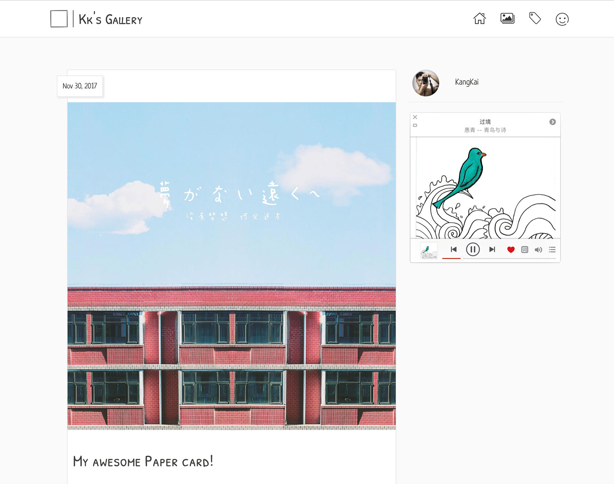

# kk-gallery

> Kallery is a web gallery based on vue
>
> Kallery 是一个基于 vue 开发的网页相册

## 12.15 更新
### PC端


### 移动端


## 使用
``` bash
yarn install

# Kallery running at localhost:6066
yarn run dev

# build for production with minification
yarn run build

# build for production and view the bundle analyzer report
yarn run build --report

# run unit tests
yarn run unit

# run all tests
yarn test
```

## 下一步
- 完成 PC 端音乐盒
- 引入 fancyBox
- 图片懒加载
- 播放音乐
